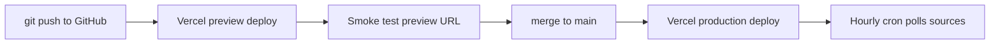

# Deployment — GitHub + Vercel

This project is built to push to **GitHub** and deploy on **Vercel** with managed Postgres and Blob storage from the Vercel Marketplace.

## Architecture on Vercel

| Component | Service |
|-----------|---------|
| Web app | Next.js 16 in `apps/web` |
| Database | Neon Postgres (Marketplace) |
| File storage | Vercel Blob |
| Cron ingestion | Vercel Cron → `/api/cron/poll` |
| AI summaries | Vercel AI Gateway |
| Email | Resend |

## One-time setup

### 1. GitHub

```bash
git init
git add .
git commit -m "Initial commit: Block A recon + project scaffold"
git remote add origin git@github.com:YOUR_ORG/TruthCommission.git
git push -u origin main
```

Use a **private** repo if you prefer; no secrets should be committed (see `.gitignore`).

### 2. Vercel project

1. Import the GitHub repo at [vercel.com/new](https://vercel.com/new).
2. **Root Directory:** `apps/web`
3. **Install Command:** `npm install --prefix ../..` (auto-set via [`apps/web/vercel.json`](apps/web/vercel.json))
4. **Framework Preset:** Next.js (auto-detected)

### 3. Marketplace integrations (Vercel dashboard)

Install from **Storage** / **Marketplace**:

| Integration | Env vars injected |
|-------------|-------------------|
| **Neon Postgres** | `POSTGRES_URL` |
| **Vercel Blob** | `BLOB_READ_WRITE_TOKEN` |

Add manually in **Project → Settings → Environment Variables**:

| Variable | Environments | Notes |
|----------|--------------|-------|
| `RESEND_API_KEY` | Production, Preview | Email alerts |
| `EMAIL_FROM` | Production, Preview | Verified sender domain |
| `AI_GATEWAY_API_KEY` | Production, Preview | Summaries |
| `CRON_SECRET` | Production, Preview | Random string; secures cron routes |
| `NEXT_PUBLIC_APP_URL` | Production, Preview | `https://your-domain.vercel.app` |

### 4. Local env sync

```bash
cd apps/web
vercel link
vercel env pull .env.local
```

Never commit `.env.local`.

### 5. Cron jobs (after Block C ingest)

In `apps/web/vercel.json`:

```json
{
  "crons": [
    {
      "path": "/api/cron/poll-sources",
      "schedule": "0 * * * *"
    }
  ]
}
```

Cron requires **Vercel Pro** on the production deployment. Preview deployments do not run crons.

## Deploy flow



- **Every PR / branch push** → preview URL for testing.
- **Merge to `main`** → production.
- Promote a preview to production from the Vercel dashboard if needed.

## Custom domain (optional)

1. Vercel project → **Domains** → add your domain.
2. Set `NEXT_PUBLIC_APP_URL` to the production URL.
3. Configure Resend sender domain for email deliverability.

## What gets deployed when (by block)

| Block | Deployable? | Notes |
|-------|-------------|-------|
| **A (now)** | Static recon only | Push `recon/` + docs; no Vercel app yet |
| **B** | Hello-world Next.js | First Vercel deploy; DB migrations |
| **C** | Subpoena MVP | Production-worthy beta |
| **D+** | Full platform | Transcripts, signup, engagement |

## Commands reference

```bash
# Preview deploy from CLI (requires prior vercel link)
vercel

# Production deploy — only when you explicitly want prod
vercel --prod
```

Per project policy: confirm before any production deploy or git push to remote.
